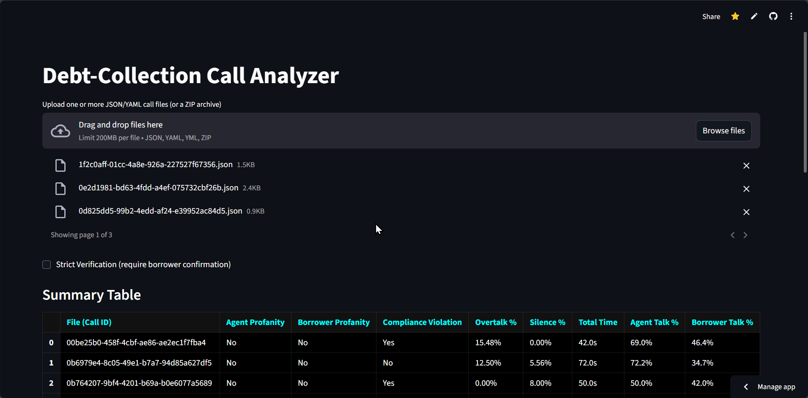
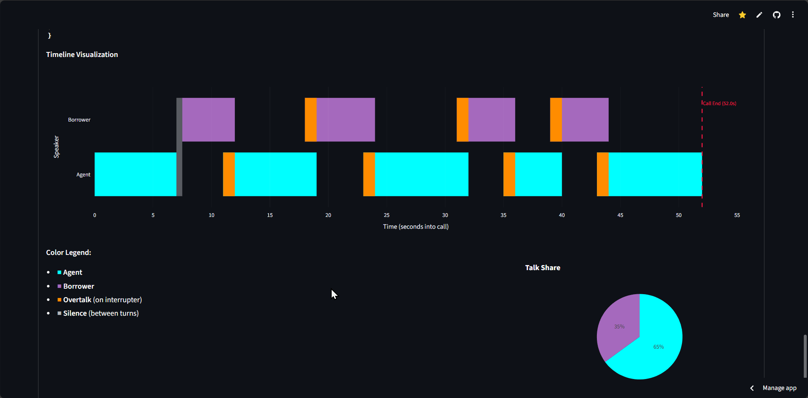
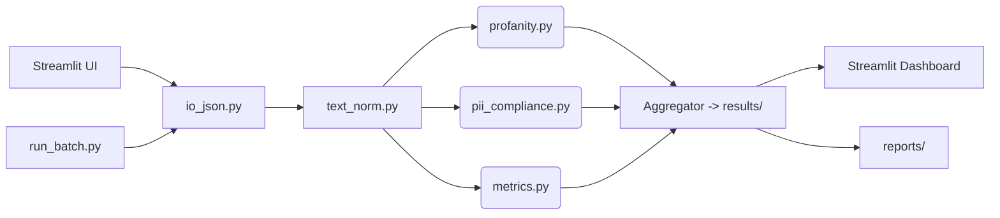

# Debt Collection Call Analyzer - AI-ready, auditable compliance for call analysis


[](https://www.python.org/downloads/)
[](LICENSE)
[](https://streamlit.io)

---

## Why This Exists

Debt collection calls are highly regulated. A single compliance violation (like disclosing sensitive information before verifying borrower identity) can result in **severe legal and financial penalties**. Manual QA reviews are costly, inconsistent, and non-scalable. Compliance teams struggle to keep up, and agent feedback is often inconsistent. This project automates the entire process, providing fast, objective, and fully auditable insights from raw call data.

---

## What It Does

The **Debt Collection Call Analyzer** provides an auditable, deterministic framework for analyzing call transcripts. It delivers:

* 🔍 **Automate Compliance**  
Detect “verify-before-disclose” violations and profanity with timestamped, reviewable evidence. Every flag is backed by deterministic logic—ideal for audits and legal defensibility.

* 📊 **Quantify Call Quality**  
Replace vague feedback with hard metrics:
  - 🗣️ **Overtalk %** — Measures interruptions and dominance.
  - 🤐 **Silence %** — Flags disengagement or awkward pauses.
  - ⚖️ **Talk-Time Balance** — Visualizes agent vs. borrower speaking share.

* ⚡ **Increase Efficiency**  
Analyze thousands of calls in minutes—not weeks—using a high-speed batch processing engine. Outputs are ready for Excel, BI dashboards, or audit workflows.

* 🧩 **Empower Non-Technical Users**  
Externalized rules engine (e.g., `profanity_patterns.txt`, `pii_patterns.txt`) allows compliance teams to update detection logic without touching code. Just edit a text file—no engineering bottlenecks.

Target users:

* Compliance teams in financial institutions
* QA analysts in BPO/call centers
* Researchers exploring human-agent interaction

---

## Live Demo

👉 Try the interactive web app on **[Streamlit Cloud](https://debt-call-analyst.streamlit.app/)**

---

## Visual Walkthrough

**Summary Dashboard** – Upload single or multiple transcripts (including `.zip` archives) and instantly see a high-level summary of violations & KPIs, compliance flags and quality metrics for the entire batch.



**Interactive Timeline** – Select any call from the summary to perform a deep-dive. This view renders the entire conversation on a timeline, visually highlighting periods of overtalk (interruptions) and silence for rapid, intuitive review.



---

## Quick Start

```bash
# 1. Clone the repository
git clone https://github.com/AryamanGupta001/debt-collection-call-analyzer.git
cd debt-collection-call-analyzer

# 2. Install dependencies
pip install -r requirements.txt

# 3. Run the interactive app
streamlit run app.py
```
---
## ⚙️ Advanced Usage: Batch Processing

For analyzing large datasets, the command-line interface is the most powerful tool.

```bash
# Run analysis on the sample data directory
python run_batch.py --input_dir data/

# Run in "strict" mode for more rigorous compliance checks
python run_batch.py --input_dir data/ --strict
```
The output files (`summary.csv`, `details.xlsx`, etc.) will be generated in the `results/` directory, ready for integration with BI tools or other workflows.

---
## Key Features

* **Interactive Dashboard**: Intuitive charts and visual timelines
* **Batch Processing CLI**: Scale to thousands of transcripts
* **Auditable Compliance Logic**: Regex rules tracked and explainable
* **Quantitative Metrics**: Overtalk %, Silence %, Talk-share
* **Pluggable Patterns**: Easy-to-edit text files for compliance/profanity rules

---

## System Architecture



---

## Roadmap

* [ ] **Phase 2: ML/LLM integration** for nuanced violation detection
* [ ] **Containerization with Docker** for seamless deployment
* [ ] **CI/CD pipeline** for automated testing and code quality

---

## Contributing

We welcome contributions from compliance experts, developers, and researchers.

* Fork the repo & submit PRs
* Update `patterns/*.txt` with new compliance or profanity rules
* Add test cases in `tests/`

This project thrives on community contributions. Whether it's reporting a bug, proposing a new feature, or submitting a pull request, your input is valued. Please check the **[Issues Tab](https://github.com/AryamanGupta001/debt-collection-call-analyzer/issues)** to see where you can help.

---

## License

Licensed under the [MIT License](LICENSE).

---

## Maintainers & Contact

Developed by **Aryaman Gupta**

* 📧 Email: [aryamangupta353@gmail.com](mailto:aryamangupta353@gmail.com)
* 💼 LinkedIn: [Aryaman Gupta](https://www.linkedin.com/in/aryaman-gupta)
* 🐙 GitHub: [AryamanGupta001](https://github.com/AryamanGupta001)

---

> ⚡If this project saves your compliance team **hours of manual review**, don’t forget to ⭐ star the repo!
